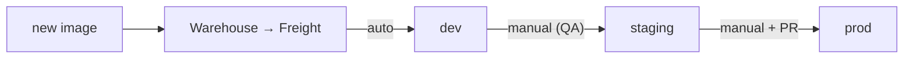

# Akuity-Platform-Onboarding

Demonstration of Akuity platform onboarding process for Argo CD and Kargo

# Kargo Quickstart Template

These are the supporting files for [the Kargo Quickstart tutorial](https://docs.akuity.io/tutorials/kargo-quickstart/) in the Akuity docs.

This tutorial will walk you through a working example using Kargo with the Akuity Platform, to manage the promotion of an image from stage to stage in a declarative way.

Ultimately, you will have a Kubernetes cluster, with Applications deployed using an Argo CD control plane; and handle promotion with Kargo.

# Kargo Promotion Pipeline: Auto-Promote Dev, PR-Gated Prod, and CVE Scanning

This solution extends the base quickstart template into a more production-shaped delivery pipeline.

In base, you manually "promote" for every environment in Kargo. This implementation adds promotion governance: a new image is discovered by the Warehouse on its default 5-minute poll, becomes Freight, and deploys to dev automatically; staging is promoted on a deliberate QA decision; and prod requires a reviewed, merged pull request.

It also enables Akuity Intelligence declaratively, running a current Argo CD release with CVE scanning turned on.

## Setup & Overall Design

One application (`guestbook`), one cluster (`kargo-quickstart`), three stages that live as namespaces (`guestbook-simple-<env>`). Kargo orchestrates promotion; Argo CD on the Akuity Platform does the deploying. The entire pipeline is driven by a single image and a single Warehouse.

A new tag pushed to `ghcr.io/jake-painter/guestbook` is picked up by the `Warehouse` and turned into `Freight`, the promotable unit that travels left to right through the stages above.

**Each stage at a glance:**

| Stage | Promoted when | How it ships | Gate |
|-------|---------------|--------------|------|
| `dev` | new Freight appears | push rendered manifests → `env/dev` | none (fully automatic) |
| `staging` | promoted from `dev` | push rendered manifests → `env/staging` | manual QA decision |
| `prod` | promoted from `staging` | open PR → `env/prod`, wait for merge | reviewed pull request |

Every stage runs the same render-and-publish pipeline: clone `main` (the Kustomize source) and the target `env/<stage>` branch → stamp the image tag into that stage's overlay (`kustomize-set-image`) → render it to flat YAML (`kustomize-build`) → commit, push, and point the stage's Argo CD `Application` at the result. The branch is the handoff: Kargo writes rendered manifests to `env/<stage>`, and a matrix `ApplicationSet` keeps one `Application` per stage (`guestbook-simple-<env>`) synced to it.

## Key Design Decisions & Tradeoffs

**Auto-promote to `dev`, manual everywhere else:**

A `ProjectConfig` ([`kargo/project.yaml`](kargo/project.yaml)) enables auto-promotion for the `dev` stage only, so a new image lands in `dev` with no human action. `dev` is where fast feedback matters most and a bad deploy costs nothing. `staging` and `prod` stay manual on purpose: `staging` is the QA checkpoint, and a person decides when a change is ready to move on.

**A pull-request gate on `prod`:**

The base template pushed rendered manifests straight to production; this pipeline opens a PR into `env/prod` and waits for the merge before syncing ([`kargo/stages.yaml`](kargo/stages.yaml)). Nothing ships to prod without a human approving it, and because the branch holds *rendered* manifests, the PR diff shows the exact resources changing, not a Kustomize overlay you'd have to render in your head.

- **Why this is the style most teams use:** The cost of a mistake rises stage by stage, so the automation should too: fast where it's cheap to be wrong, gated where it isn't. PR-gated production earns its place because it creates a reviewed, attributable, audit-friendly record of every production change (often a compliance requirement), keeps unreviewed code from auto-shipping to customers, and reuses the Git review workflow teams already run instead of inventing a separate approval system.

**Pinned revision for `dev`/`staging`, branch head for `prod`:**

`dev` and `staging` pin `argocd-update` to the commit they just pushed, so Argo CD syncs exactly what Kargo rendered. In the case of `prod` it can't. Merging the PR creates a *new* commit, so a pin would hang waiting for a revision that never syncs. Prod syncs the branch head after merge instead to avoid this.

**Rendered manifests on environment branches:**

Kargo pushes rendered YAML to `env/<stage>` branches rather than having Argo CD run Kustomize itself. This keeps deployed state explicit and auditable in Git (and is what makes the prod PR diff meaningful), at the cost of more complex promotion steps.

**Akuity Intelligence for visibility and operations:**

Intelligence earns its place for three things beyond the pipeline itself: consolidated metrics and health visibility across the whole cluster (including resources Argo CD doesn't manage) without leaving the Argo CD and Kargo UIs; an agent to interact with the platform in plain language, asking about live state (application status, resource diffs, Kargo freight and promotions) instead of clicking through the UI to assemble it, with actions scoped to the invoking user's permissions; and CVE scanning of the images actually running (covered next). It's enabled declaratively like the rest of the platform config: on the instance ([`akuity/argocd.yaml`](akuity/argocd.yaml), `akuityIntelligenceExtension`) and the cluster ([`akuity/cluster.yaml`](akuity/cluster.yaml), `multiClusterK8sDashboardEnabled`).

**CVE scanning on running images:**

In the same instance spec, `kubeVisionConfig.cveScanConfig` scans the container images of workloads in the cluster every 8 hours and reports each known vulnerability: CVE ID, severity, installed vs. fixed version. This is the one choice with a version dependency: CVE scanning needs a recent Akuity agent (v0.5.49+), which is why the instance is pinned to the current 3.4.x release (`v3.4.3-ak.92`) and the agent is kept current.

## Assumptions
 
- **Single cluster:** `dev`, `staging`, and `prod` are namespaces on one cluster (`kargo-quickstart`), not separate clusters. Promotion moves a release across namespaces, not across cluster boundaries.
- **`env/prod` already exists:** the prod stage opens a pull request against `env/prod`, so that branch has to be present as the merge target. The stage does not create it.
- **The prod gate's strength depends on branch protection:** Kargo waits for the pull request to merge, but it does not decide who may merge or whether a review happened. Enforcing real human review requires branch protection configured on `env/prod`, which is a GitHub ruleset that can be added in your repo Settings under the Rules section. Instructions for that setup can be found here: [Bonus: Enforcing the prod gate with a branch ruleset in GitHub](#bonus-enforcing-the-prod-gate-with-a-branch-ruleset-in-github).
- **The image is public:** the `Warehouse` polls `ghcr.io/jake-painter/guestbook` with no registry credentials, which assumes the package stays publicly readable.
- **The Akuity agent meets the CVE-scan minimum:** image scanning requires agent v0.5.49+, and this cluster runs a current agent, so the feature is available.

## Additional Considerations

**Why not auto-promote every stage?**

Auto-promotion is intentionally scoped to `dev`. Extending it to `staging` or `prod` would remove the QA checkpoint and the production approval that give the pipeline its safety. The value here is matching automation to the risk of each environment, not maximizing automation everywhere.

**Bring your own keys / models (BYOK)**

Akuity Intelligence supports Bring Your Own Key, pointing the assistant at your own model provider (any OpenAI- or Anthropic-compatible API) instead of Akuity's default catalog. It isn't available on the trial tier used for this exercise, so it isn't configured here, but it would be a strong demonstration of three things teams care about:
- **Flexible cost management:** option of billing AI usage to your own provider keys, so spend is owned and capped directly.
- **Enhanced data privacy and compliance:** keeping all AI traffic inside a private or on-premises model deployment, which matters for organizations with strict privacy or regulatory requirements.
- **Freedom to use the latest models:** reaching any newly released or alternative model the default catalog doesn't include, simply by adding a provider key.

## Bonus: Enforcing the prod gate with a branch ruleset in GitHub

NOTE: Only set this up if you have another GitHub user account to use as an authorized approver, as your own commits will not be allowed to be approved by you.

1. In the GitHub repository, go to **Settings** > **Rules** > **Rulesets** > **New ruleset** > **New branch ruleset**.
2. Name it (for example, `protect-env-prod`) and set **Enforcement status** to **Active**. The *Evaluate* status only logs hits, it does not block.
3. Under **Target branches**, choose **Add target** > **Include by pattern** and enter `env/prod`.
4. Under **Branch rules** leave defaults, and enable:
   - **Require a pull request before merging**, then **Require approvals** with at least **1** required approval.
   - **Dismiss stale pull request approvals when new commits are pushed**, so a fresh render pushed to the PR re-triggers review.
   - **Block force pushes** (on by default) and **Restrict deletions**, so the rendered history on `env/prod` cannot be rewritten or dropped.
5. Leave the **Bypass list** empty, then click **Create**.
